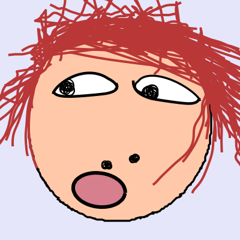

# ugly-avatar-generated

Generated ugly avatar files

The avatar files in this repository are generated with the help of the [ugly-avatar](https://github.com/txstc55/ugly-avatar) project and the [ugly-avatar-api](https://github.com/mamumu123/next-api-share) project. Thanks to these two projects for the great works.

此仓库中的头像文件是借助 [ugly-avatar](https://github.com/txstc55/ugly-avatar) 项目以及 [ugly-avatar-api](https://github.com/mamumu123/next-api-share) 生成的。在此，我们向这两个项目致以诚挚的感谢。

## Our Extensions and Userscripts

- [🏷️ UTags - Add usertags to links](https://github.com/utags/utags) - Allow users to add custom tags to links.
- [🔗 Links Helper](https://github.com/utags/links-helper) - Open external links in a new tab, open internal links matching the specified rules in a new tab, convert text to hyperlinks, convert image links to image tags, parse Markdown style links and image tags, parse BBCode style links and image tags
- [Replace Ugly Avatars](https://github.com/utags/replace-ugly-avatars) - Replace specified user's avatar (profile photo)

## >\_

